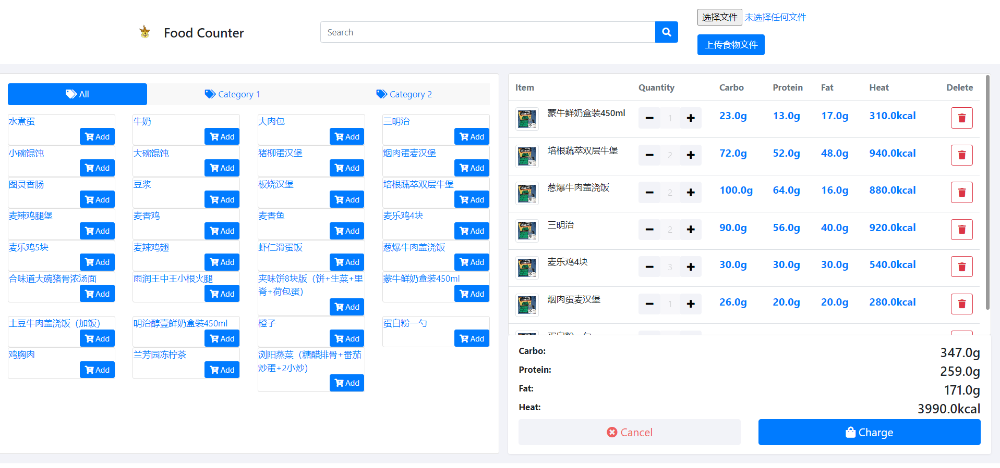
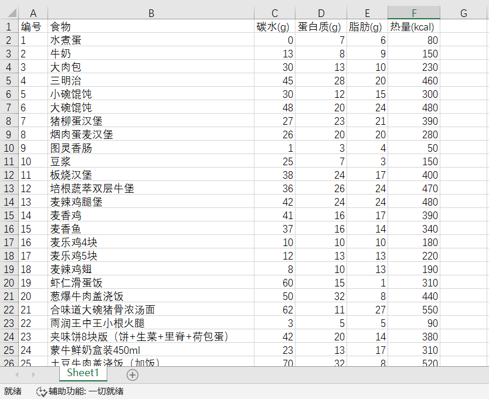

# Food Counter



一个营养计算器，支持下列功能
- 导入食物数据（excel）
- 增删改查食物
- 计算碳水/蛋白质/脂肪/热量总和

运行方式
```
mvn spring-boot:run
```

## 使用说明

访问 localhost:8080，默认食物数据已填充至左侧。如有自定义需求，请自行生成 excel 文件，格式如 [uploads/foods.xlsx](uploads/foods.xlsx) 所示：



生成后点击"选择文件"-"上传自定义食物表"，即可更新食物数据。

选择食物/搜索框模糊搜索食物，即可对食物进行增删查。


## TODO

- [x] excel导入从固定路径变为文件上传
- [x] 模糊搜索食物名称
- [ ] ...